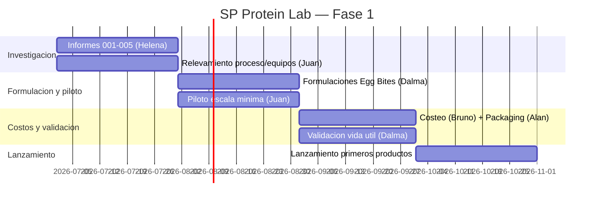

# Plan de Implementación — SP Protein Lab (Fase 1: Huevo)

> Ing. Juan Manuel Grasso — Jefe de Operaciones e Ingeniería. 01/07/2026.
> Criticidad: **Media** (no frena P1–P13). Arranque: **piloto a escala mínima con recursos actuales**.

## Objetivo

Validar y lanzar los primeros productos proteicos a base de huevo (insignia: Egg Bites sous vide), primero como piloto de bajo costo, dejando la industrialización condicionada a la Sala Rompedora (P6).

## Equipo y roles

| Rol | Persona | Responsabilidad |
|---|---|---|
| Dirección | Juancho | Estrategia, escala del piloto |
| Finanzas | Bruno | Costeo, CAPEX/OPEX, breakeven |
| Estrategia / Mercado | Helena | Investigación, portafolio, precios |
| Marketing / Marca | Alan | Packaging, canales, lanzamiento |
| I+D Alimentos | Dalma | Formulación, vida útil, HACCP |
| Ingeniería de proceso y equipos | **Juan Grasso** | Proceso, equipamiento, cruces con planta |
| Asesor externo | ChatGPT | Apoyo estratégico |

## Fases y cronograma

**M1 — Investigación y benchmark**
- Helena: informes 001–005 (mercado, competencia, tecnologías, portafolio, costos).
- Juan: relevamiento del proceso sous vide y de los equipos de cocina disponibles para el piloto.

**M2 — Formulación y piloto (escala mínima)**
- Dalma: formulaciones Egg Bites (3 sabores) + primeras pruebas.
- Juan: correr el piloto con equipos actuales; registrar parámetros (temperaturas, tiempos, rendimiento, merma).

**M3 — Costos, packaging y validación**
- Bruno: costeo con input de ingeniería. Alan: packaging. Dalma: validación de vida útil (30–45 días, a validar).

**M4 — Lanzamiento**
- Primeros productos de huevo al canal (gimnasios / cafeterías / retail).

## Ruta crítica y dependencias

- El **piloto (M2) NO depende de P6**.
- La **industrialización / volumen depende de P6** (Rompedora) → y P6 de la cloaca P4. `[Probable]`
- La **validación de vida útil** (Dalma) es prerrequisito del lanzamiento M4.

## Cronograma (Gantt)

## Criterios de éxito

- Piloto: Egg Bites reproducibles, con proceso documentado.
- Vida útil validada ≥ 30 días refrigerado.
- Costeo que confirme margen **antes** de invertir en equipos.
