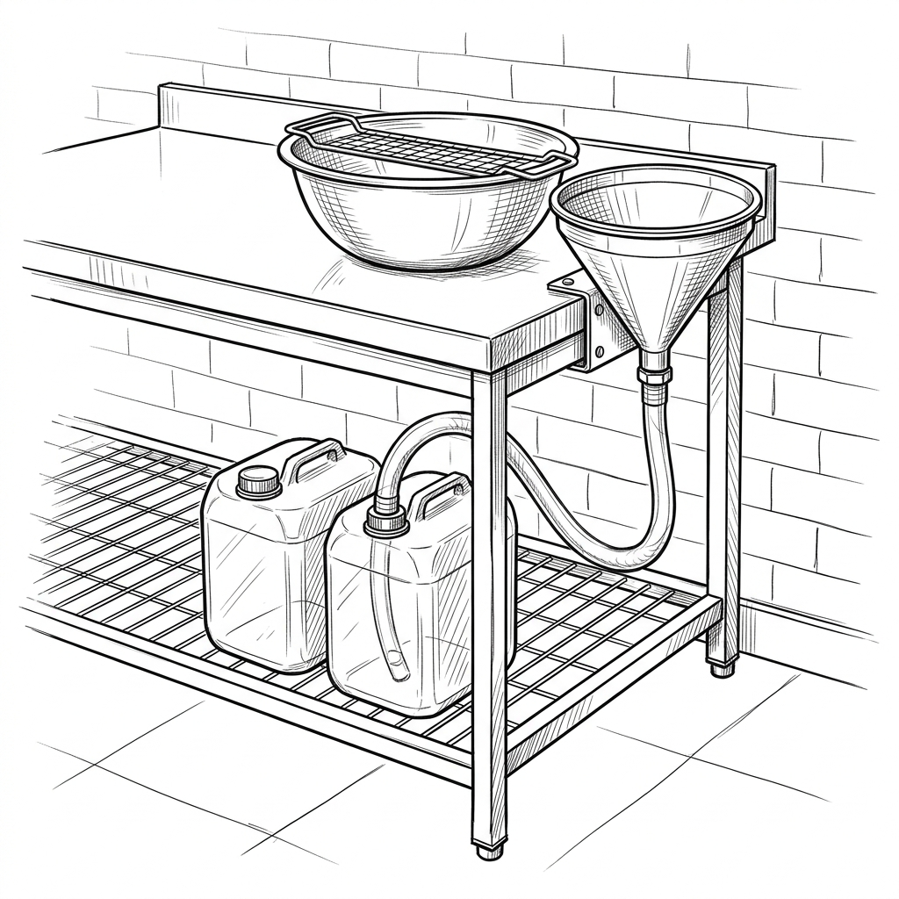
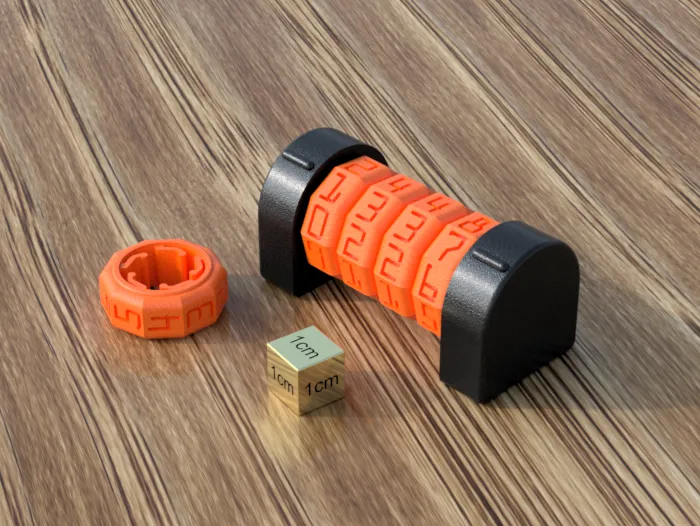

# Proyecto de Estandarización y Mejora Continua
**Departamento de Producción - Sabor Pampeano**

## 1. Introducción
El presente documento detalla las iniciativas de estandarización orientadas a optimizar los tiempos de producción, garantizar el cumplimiento de normativas bromatológicas y de seguridad e higiene, y reducir sistemáticamente las mermas de materia prima. Se trata de un documento vivo que se irá actualizando a medida que se implementen mejoras en la planta.

## 2. Mejora en Procesamiento de Huevo Líquido

### Estado Actual
El cascado de huevos se realiza de manera manual directamente sobre un bowl, pasando el contenido por un embudo suelto a los bidones de 8 litros. 
*   **Problemas detectados:** 
    *   Alto riesgo de merma: Un solo huevo en mal estado puede contaminar un bowl completo o el embudo, forzando a descartar una gran cantidad de producto (hasta 5 maples perdidos).
    *   Proceso lento e ineficiente (1h 30m por lote diario).
    *   Ergonomía deficiente, con riesgo de vuelcos y suciedad en el área de trabajo.

### Mejora Propuesta: Estación de Llenado en Matriz
Implementar un sistema de cascado por gravedad. Se fijará un embudo de boca ancha a la mesada, con una manguera de grado alimenticio. Debajo de la mesada, se colocará un estante que albergará la matriz completa de bidones para el lote diario (ej. 18 bidones, en una cuadrícula de 6x3).

*   **Procedimiento:** El operario casca un maple (30 huevos) en un bowl de acero inoxidable (30-40cm). Tras verificar visual y olfativamente el estado, lo vuelca en el embudo. El fluido cae directo al primer bidón. Al llenarse, simplemente mueve la manguera al bidón contiguo. Al finalizar la matriz completa, se tapan todos los bidones en serie.

### Impacto
*   **Ahorro Económico:** La pérdida máxima ante un huevo descompuesto queda "blindada" en 30 huevos, salvando sistemáticamente el resto de la producción.
*   **Eficiencia:** El llenado continuo sin detenerse a cambiar y tapar bidones agiliza radicalmente la tarea.
*   **Bromatología:** El área se mantiene mucho más limpia al eliminar trasvases inestables.

## 3. Reestructuración de Cámara de Frío y Trazabilidad

### Estado Actual
Las tartas y tortillas se estiban en cajones de 67x56x16cm acumulados dentro de la cámara sin un sistema de loteo unificado ni guías organizadoras.
*   **Problemas detectados:**
    *   Imposibilidad de garantizar visualmente el sistema FIFO (First In, First Out).
    *   Riesgo crítico de no conformidades ante auditorías bromatológicas por falta de trazabilidad.

### Mejora Propuesta: Estanterías Ergonómicas y Loteo por Bloques
Construcción de módulos de estanterías mediante montantes y soleras de chapa galvanizada (anti-óxido, exigido por normativas de cámaras frigoríficas).
*   **Diseño Físico:** Cada bandeja pesa **21.6 kg**. Para que su manipulación sea cómoda y segura para el operario, se limitará la estantería a un máximo de 5 niveles (altura del estante superior a 1.10m).
*   **Sistema de Lote Diario (Trazabilidad Simplificada):** La producción de un día (ej. 500 tartas y 120 tortillas) ocupa 18 cajones. Esto equivale exactamente a un bloque de **4 columnas** de estantes. A este bloque completo se le asignará el mismo número de lote diario, señalizado mediante un contador numérico impreso en 3D (ej. Lote 315) en la parte superior.

### Impacto
*   **Trazabilidad 100% Garantizada:** Los encargados de ventas y armado de pedidos retiran siempre la mercadería del bloque de 4 columnas con el número más bajo (FIFO visual inmediato).
*   **Operatividad Segura:** La altura máxima controlada facilita el trabajo diario y reduce la fatiga del personal.

## 4. Seguridad e Higiene Laboral

### Estado Actual
Matafuegos fuera de la cocina y botiquín de primeros auxilios ubicado junto a insumos productivos en estantes.

### Mejora Propuesta e Impacto
*   **Matafuegos:** Reubicación en el interior de la cocina a una altura máxima de 1.50m (parte superior). Garantiza acceso inmediato ante focos de incendio y cumplimiento estricto con las exigencias de ART.
*   **Botiquín:** Fijación a pared en área seca, separando insumos médicos de las materias primas para erradicar el riesgo de contaminación cruzada.

## 5. Prueba Piloto: Cocción de Tartas

### Estado Actual
La masa de las tartas industriales presenta ocasionalmente una textura gomosa y falta de dorado en la base, debido a la retención de humedad del relleno durante la cocción en moldes de chapa ciega.

### Mejora Propuesta: Implementación de Moldes Microperforados
Se propone la adquisición de un lote mínimo (10-20 unidades) de moldes microperforados para realizar una prueba piloto de cocción A/B.
*   **Fundamento Técnico:** Las microperforaciones permiten la evaporación del agua excedente de la masa y el relleno directamente por la base, generando un efecto de secado mecánico que asegura una textura crujiente ("crust") sin necesidad de blanquear la masa ni alterar la receta actual.
*   **Evaluación de Viabilidad:** Durante la prueba se evaluarán factores clave:
    1. Permeabilidad y goteo de los rellenos actuales.
    2. Eficiencia del calor de piso en los hornos actuales.
    3. Facilidad del lavado de los moldes post-producción.

### Impacto
*   **Aumento en la Calidad:** Mejora directa de la percepción organoléptica del cliente (masa crocante y dorada).
*   **Eficiencia:** Solución puramente mecánica (cambio de matricería) que no requiere añadir horas hombre ni etapas extra de producción.
